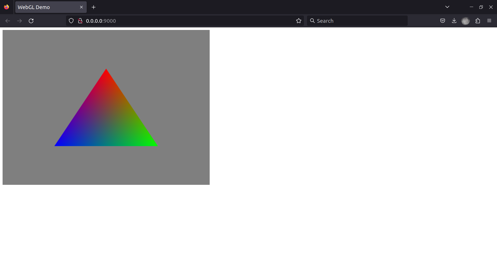

# Webgl Demo

## About
This is my first time learning WebGL.
My experience is from SDL2 and WebGL is a lot harder than I thought since I am not used to using 3D and 2D graphics library 

## Resources
- Turotial: [IndigoCS-webgl-tutorials/tree/master/01 - Simple Triangle](https://github.com/sessamekesh/IndigoCS-webgl-tutorials/tree/master/01%20-%20Simple%20Triangle)
- Thanks to [sesseamekesh](https://github.com/sessamekesh/IndigoCS-webgl-tutorials/commits?author=sessamekesh) for the tutorial

